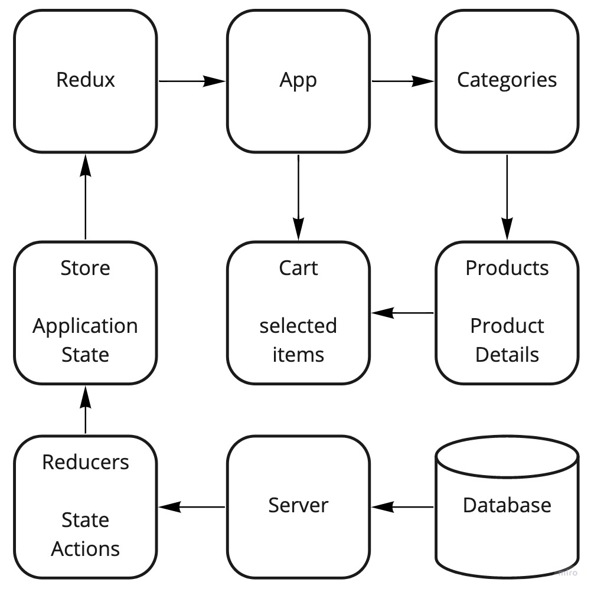

# Storefront

Lab #1 PR: [https://github.com/peterjast/storefront/pull/1](https://github.com/peterjast/storefront/pull/1)

Lab #2 PR: [https://github.com/peterjast/storefront/pull/2](https://github.com/peterjast/storefront/pull/2)

Lab #3 PR: [https://github.com/peterjast/storefront/pull/3](https://github.com/peterjast/storefront/pull/3)

Deployed: [https://ps-storefront.netlify.app/](https://ps-storefront.netlify.app/)

## Install Dependences

npm i

## Run the applications

npm run start

## Data Flow

